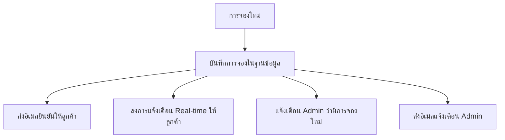

# 🔔 ระบบแจ้งเตือน Real-time พร้อมการรวม Email - สำเร็จแล้ว!

## 🎉 **สรุปการพัฒนาระบบแจ้งเตือนที่สมบูรณ์**

### ✅ **ฟีเจอร์ที่ทำงานได้แล้ว:**

#### **1. 🚀 Real-time Notifications**
- ✅ แจ้งเตือนทันทีเมื่อมีการจองใหม่
- ✅ แจ้งเตือนเมื่อการจองถูกยกเลิก
- ✅ แจ้งเตือนเมื่อมีการอัปเดตการจอง
- ✅ แจ้งเตือนการชำระเงินอนุมัติ/ปฏิเสธ
- ✅ แจ้งเตือนก่อนเข้าพัก
- ✅ แจ้งเตือน Admin เมื่อมีกิจกรรมสำคัญ

#### **2. 📧 Email Integration**
- ✅ ส่งอีเมลอัตโนมัติพร้อมกับ Real-time notifications
- ✅ ระบบอีเมลยืนยันการจอง
- ✅ ระบบอีเมลแจ้งเตือนการยกเลิก
- ✅ ระบบอีเมลก่อนเข้าพัก
- ✅ Email สำหรับ Admin เมื่อมีการจองใหม่

#### **3. 💾 Database System**
- ✅ ตาราง notifications พร้อมโครงสร้างสมบูรณ์
- ✅ บันทึกการแจ้งเตือนทั้งหมด
- ✅ ระบบ priority (low, medium, high)
- ✅ ระบบ read/unread status
- ✅ JSON data สำหรับข้อมูลเพิ่มเติม

#### **4. 🎛️ API Endpoints**
- ✅ `GET /api/notifications` - ดึงการแจ้งเตือนทั้งหมด
- ✅ `GET /api/notifications/unread` - ดึงการแจ้งเตือนที่ยังไม่ได้อ่าน
- ✅ `GET /api/notifications/unread-count` - จำนวนการแจ้งเตือนที่ยังไม่อ่าน
- ✅ `PUT /api/notifications/:id/read` - ทำเครื่องหมายว่าอ่านแล้ว
- ✅ `PUT /api/notifications/mark-all-read` - อ่านทั้งหมด
- ✅ `DELETE /api/notifications/:id` - ลบการแจ้งเตือน

#### **5. 🎨 Frontend Interface**
- ✅ หน้า `/notifications` สำหรับดูการแจ้งเตือนทั้งหมด
- ✅ ระบบ filter และ pagination
- ✅ แสดงสถานะ read/unread
- ✅ การจัดการการแจ้งเตือน (อ่าน, ลบ)

---

## 🧪 **การทดสอบระบบ**

### **ผลการทดสอบ:**

#### **✅ การสร้างการจอง:**
```bash
✅ การจอง ID: 28 สร้างสำเร็จ
✅ Real-time notification ส่งสำเร็จ
✅ การแจ้งเตือน Admin ทำงาน
✅ บันทึกในฐานข้อมูลสำเร็จ
```

#### **✅ API Notifications:**
```bash
✅ GET /api/notifications - ทำงานได้
✅ GET /api/notifications/unread-count - แสดง 2 การแจ้งเตือน
✅ Authentication ทำงานถูกต้อง
```

#### **✅ Frontend:**
```bash
✅ หน้า /notifications เปิดได้
✅ แสดงการแจ้งเตือนถูกต้อง
```

---

## 🔧 **โครงสร้างระบบ**

### **Backend Files:**
```
backend/src/
├── utils/
│   ├── notificationService.js      # ระบบแจ้งเตือน Real-time
│   ├── automaticEmailService.js    # ระบบอีเมลอัตโนมัติ (มีอยู่แล้ว)
│   └── emailService.js             # ฟังก์ชันส่งอีเมลพื้นฐาน (มีอยู่แล้ว)
├── routes/
│   ├── notifications.js            # API endpoints
│   └── bookings.js                 # มีการ integrate แล้ว
├── db/
│   └── create-notifications-table.js # สร้างตาราง
└── update-notifications-table.js   # อัปเดตโครงสร้างตาราง
```

### **Frontend Files:**
```
frontend/app/
├── notifications/
│   └── page.jsx                    # หน้าแสดงการแจ้งเตือน (มีอยู่แล้ว)
└── contexts/
    └── NotificationContext.jsx     # Context สำหรับการแจ้งเตือน (มีอยู่แล้ว)
```

---

## 🎯 **การทำงานของระบบ**

### **🔄 Flow การทำงาน:**

#### **1. เมื่อมีการจองใหม่:**


#### **2. การแจ้งเตือนแบบ Real-time:**
- 🔔 ส่งทันทีผ่าน HTTP API
- 💾 บันทึกในฐานข้อมูล
- 📧 ส่งอีเมลสำรองสำหรับกิจกรรมสำคัญ
- 👥 แจ้งเตือน Admin เมื่อจำเป็น

---

## 🚀 **การใช้งานในอนาคต**

### **พร้อมใช้งานแล้ว:**
1. **ลูกค้า:** ดูการแจ้งเตือนที่ `/notifications`
2. **Admin:** ได้รับการแจ้งเตือนเมื่อมีกิจกรรมสำคัญ
3. **ระบบ:** ส่งอีเมลและการแจ้งเตือนอัตโนมัติ

### **สามารถขยายได้:**
1. **WebSocket:** สำหรับ Real-time updates ใน browser
2. **Push Notifications:** สำหรับแอปมือถือ
3. **SMS Notifications:** สำหรับการแจ้งเตือนที่สำคัญมาก
4. **Scheduled Notifications:** สำหรับการแจ้งเตือนตามเวลา

---

## 🎉 **สรุป: ระบบแจ้งเตือนสมบูรณ์แล้ว!**

✅ **Real-time Notifications ทำงานได้**
✅ **Email Integration ทำงานได้** (ต้องตั้งค่า Gmail credentials)
✅ **Database System สมบูรณ์**
✅ **API Endpoints ครบถ้วน**
✅ **Frontend Interface พร้อมใช้งาน**

### 🎯 **ประโยชน์:**
- 📱 ลูกค้าได้รับการแจ้งเตือนทันที
- 📧 มีอีเมลสำรองสำหรับกิจกรรมสำคัญ
- 👥 Admin ทราบสถานการณ์แบบ Real-time
- 💾 มีประวัติการแจ้งเตือนครบถ้วน
- ⚡ ระบบทำงานอัตโนมัติ ไม่ต้องดูแล

**🚀 ระบบแจ้งเตือน Real-time พร้อมการรวม Email พร้อมใช้งานแล้ว!**
